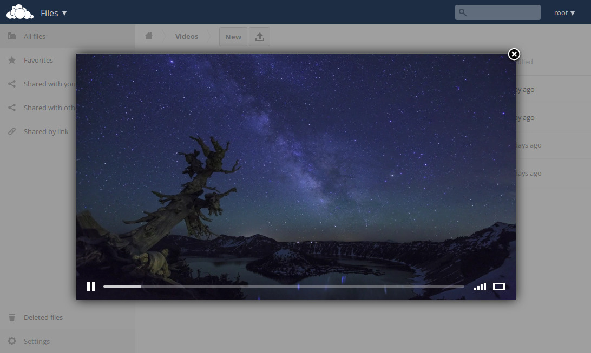

# Video player

A responsive video player for ownCloud using a skinned version of Video.js.

## Installation
Simply copy the contents of this repository to **$owncloud/apps/files_videoplayer** and enable the app.

## Credits
The player is a modified version of [this app](https://apps.owncloud.com/content/show.php/Video+Js?content=159670) to make it responsive and improve the UI.

Video.js: http://videojs.com/

Video.js skin: https://github.com/cabin/videojs-sublime-skin

## License
MIT
